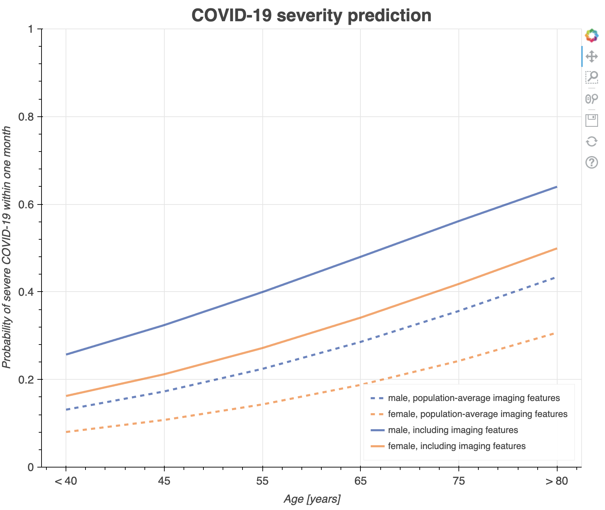

# Covid_severity_prediction

This model predicts the probability that a patient will develop severe COVID-19 within one month of the baseline CT scan acquisition. Severe COVID-19 is defined as death or the need for intubation.
The prediction is made based on features derived from the CT scan as well as the patient's age and sex.

[//]: # (![Model prediction curves]&#40;docs/plot.png&#41;)
<p align="center">
  
</p>

This plot is reproduced from the supplementary material of the associated publication and is provided for illustration. It is not generated by the code in this repository. The dashed lines represent predicted probabilities using population-average imaging features, while the dotted lines use imaging features from a specific CT scan.

## Installation
This repository is provided for reproducibility and is not actively maintained. The code was tested using Python 3.7.

Install the required Python packages with:
```bash
pip install -r requirements.txt
````

## Usage
The CT image and the patient's age and sex should be provided in the _input_ folder according to: <br>
```text
input/
├── patient_id/
│   └── CT.nii.gz
└── demographic_data.csv
```
Two example patients are given in demographic_data.csv to demonstrate the format.

## Citation
For more details see our [publication](https://doi.org/10.1186/s12911-025-02983-z). 

If you use this tool, please cite:
> Dirks, I., Bossa, M., Berenguer, A. et al. Development and multicentric external validation of a prognostic COVID-19 severity model based on thoracic CT. *BMC Medical Informatics Decision Making* **25**, 156 (2025). https://doi.org/10.1186/s12911-025-02983-z
